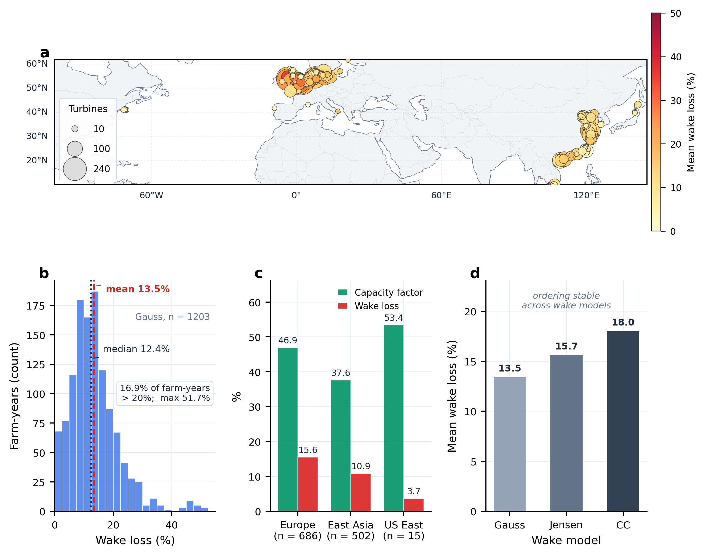
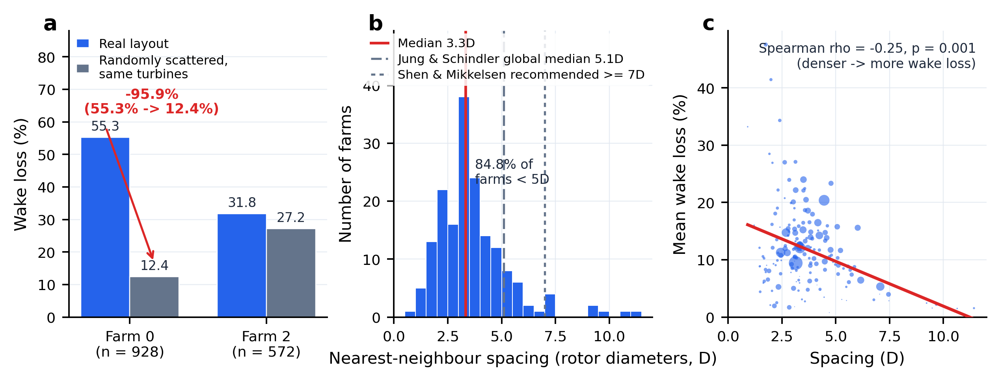
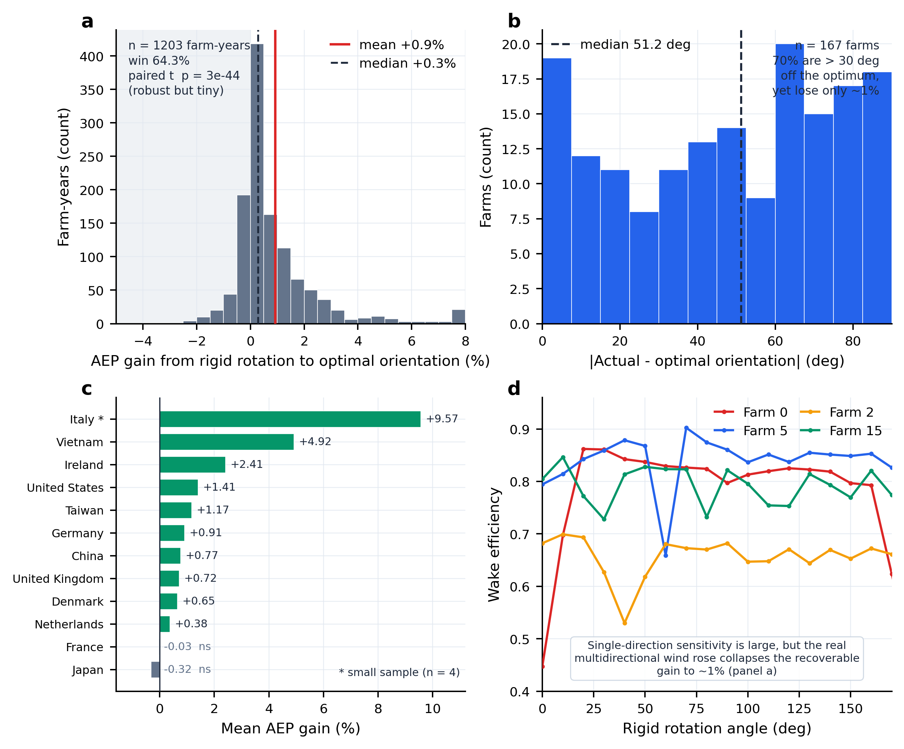
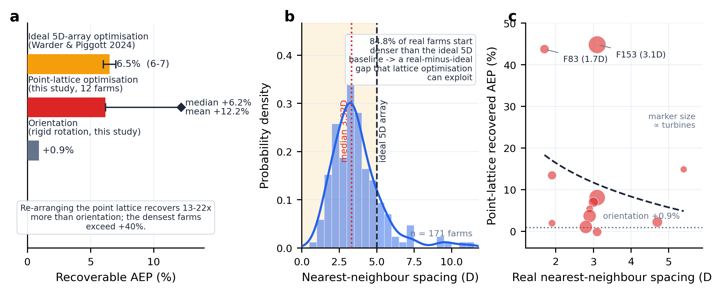
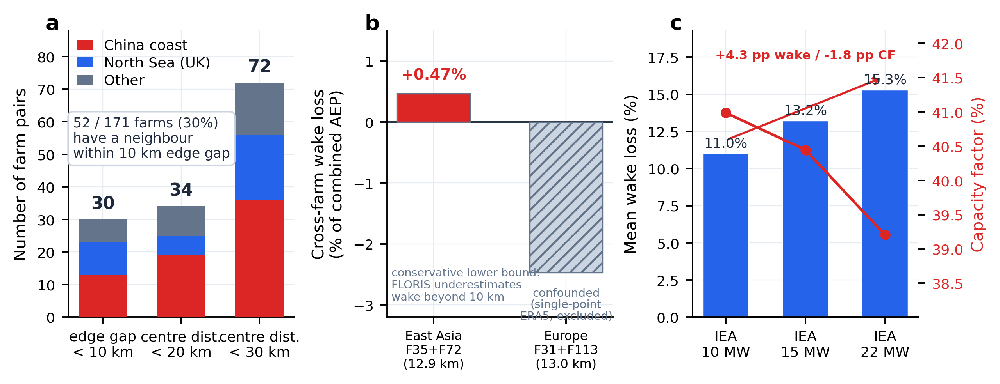
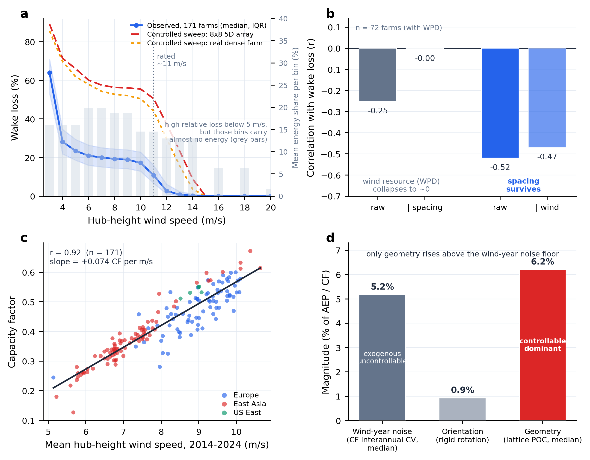
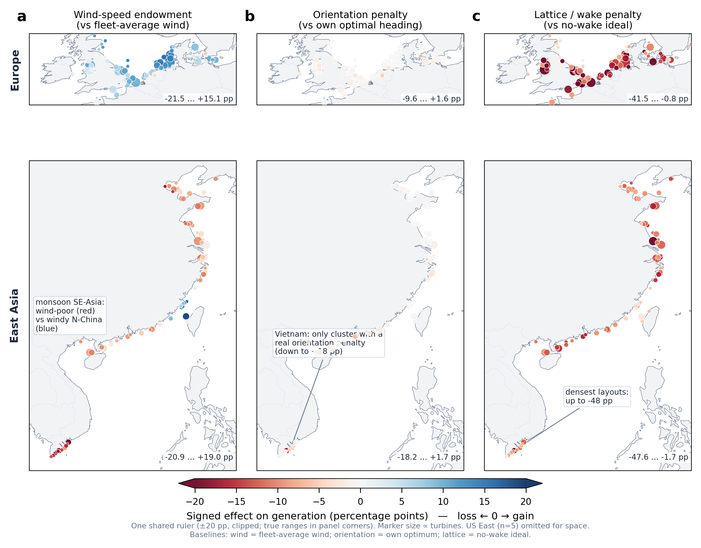

# 几何胜于对齐：排布密度而非朝向是海上风电的主导可控发电杠杆

### 基于全球 171 个真实海上风场的后验归因分析

*Geometry over alignment: array density, not orientation, is the dominant controllable lever for offshore-wind generation — a global posterior analysis of 171 real farms*

> 分析材料（NC 体例草案）· 数据口径：任务一形态识别 / 任务二 FLORIS v4.6 全量核算 / 任务三朝向后验 / 任务四跨场仿真 / 任务五情景 / 风速归因模块 · 版本 2026-07-22
> 说明：〔待补〕四项计算已于 07-19 全部补入（因果链五环闭合）；本版新增 **§2.6 风速归因模块（图 6）**——用真实轮毂风速把"风速"归位为外生背景（发电天花板 + 年际噪声），完成对"几何主导"的最后防守。派生数据见 `data_derived/`。

---

## 摘要

海上风电场一旦选定海域、机位与集电结构，其发电效率就被排布几何长期锁定；然而在"可控"设计参数中，究竟是**朝向对齐**（把阵列转到迎风最优角）还是**点阵几何**（密度、位置、间距）握着可回收的发电价值，此前缺乏基于真实风场的全球尺度证据。本研究以全球 171 个真实海上风场（17 国、15,106 台机组、2014–2024 年逐时 ERA5 风场、统一 IEA 10 MW 机型、FLORIS v4.6 尾流引擎）为对象，在**可控性（controllability）**轴上——即剥离不可控的外生风资源之后——对两类杠杆做后验归因。我们发现：真实排布的尾流损失强而系统（Gauss 均值 13.5%、中位 12.4%、离群场高达 51.7%），且其场内主导内因是**几何拥挤而非朝向失配**——在同一批机组、同一容量、同一气象下，仅打乱空间排列即可令尾流损失从 55.3% 降到 12.4%（F0，−95.9%），而真实最近邻间距中位仅 3.3 D、84.8% 的风场低于 5 D。将整场刚性旋转到历史最优朝向，虽在统计上高度稳健（配对 *t* 检验 *p* = 2.9×10⁻⁴⁴、64.3% 场-年胜出），但幅度极小（AEP 均值仅 +0.9%、中位 +0.3%）；70% 的风场实际朝向偏离最优超过 30°，却几乎不损失发电——证明**朝向是一个弱杠杆**。相反，对 12 个代表性风场的点阵优化存亡实验证实，在机组数不变下重排点阵（密度/间距）可回收 AEP **均值 +12.2%、中位 +6.2%**（区间 −0.2%~+44.8%），是朝向刚性旋转（+0.9%）的 **13–22 倍**，且原本越密的风场回收越多（最密的 1.7–3.1 D 两场超过 +40%）——中位与 Warder & Piggott（2024）理想 5 D 方阵的 6–7% 上限吻合，而真实排布起点更密使其上尾更长。可回收价值几乎完全落在点阵几何一侧，只能通过重排点阵而非旋转朝向来回收。真实风速则被归位为**外生背景**：它几乎完全决定发电水平（容量因子与年均轮毂风速 *r* = 0.92）并施加约 5% 的年际噪声，但跨场尾流损失差异几乎与风速无关（*r* ≈ −0.04；控住间距后风资源与尾流的偏相关归零，而间距的效应在控住风资源后原样存活）——外生的风速决定天花板，可控的几何决定可回收价值。最后，密集化正把场内尾流升级为跨场外部性：171 场中已有 52 场（30%）存在边缘间隙 <10 km 的近邻，~13 km 间距下跨场尾流已吃掉约 0.5% 的组合发电（保守下界），且机型升级（10→22 MW，尾流 +4.3 pp）与逐年加密都在放大这一杠杆。本研究把"几何=主导可控杠杆 → 密集化 → 跨场溢出"缝为一条以真实数据支撑的因果链，为海上风电从"选对朝向"转向"排对点阵"的设计范式提供了实证依据。

**关键词**：海上风电；尾流损失；排布几何；风场布局优化；可控性归因；跨场尾流外部性

---

## 1. 引言

海上风电的度电成本在过去十年下降过半，全球装机进入密集化阶段。风电场设计涉及风资源、水深地形、航道与保护区边界、电网接入等多重约束，其中一部分是规划者**不可控**的外生条件（风从哪里来、吹多强），另一部分则是**可控**的工程决策（机组排成什么形状、朝哪个方向、留多大间距）。一个对规划实践至关重要、却长期缺乏真实数据回答的问题是：**在可控的设计杠杆里，究竟哪一个握着可回收的发电价值？**

围绕这一问题，三支文献各自成熟，但其缝合处仍是空白：

- **风速/气候支**（Jung & Schindler 2022, *Nat. Energy*；Lei et al. 2023, *Nat. Clim. Change*）把风视为标量风速，评估气候变化对容量因子的长期影响，但不含尾流、不含排布——几何维度整体缺席。
- **排布/尾流支**（Meyers & Meneveau 2012；Warder & Piggott 2024）在理想化方阵上研究尾流与最优间距。其中 Warder & Piggott 用**固定的理想 5 D 方阵**在全球网格制图，结论是风资源分布的重叠决定尾流损失大小（*R²*≈0.98）、理想方阵内的布局优化上限约 **6–7%**。但其排布"处处固定"，因此**无法回答"在真实排布上密度与朝向谁主导"**；它答的是"排布固定时尾流损失随地理如何变"。值得注意的是，它还发现优化潜力与风向集中度正相关（中纬度潜力小），这恰恰**旁证了朝向在多数海域是弱杠杆**。
- **外部性/治理支**（Kaffine & Worley 2010；Lundquist et al. 2019, *Nat. Energy* 的 "wind theft"；2024–26 北海跨境圈）把尾流当作负外部性，但决策变量是投资量、产权与跨境走廊，**没有把排布几何当作可控治理杠杆**。

本研究的独占贡献有两点，且都依托真实数据：其一，在**可控性轴**上（而非"方差解释力"轴上——后者已由 Warder & Piggott 占据，且其结论是风资源主导）对全球 171 个**真实**风场做几何 vs 朝向的归因；其二，把"几何=主导杠杆 → 密集化 → 跨场溢出"缝为一条以实证支撑的因果链。我们刻意把命题钉在"剥离外生风资源后、在可干预子空间内，几何（密度）≫ 朝向（对齐）"，而不主张"几何解释了尾流损失的大部分方差"。

围绕三段递进结构，本材料回答三个科学问题：(1) 真实海上风场的尾流损失有多强，其场内主导内因是几何还是朝向？(2) 在可控杠杆里，调朝向与调点阵谁握着可回收价值？(3) 随密集化推进，场内尾流何时升级为跨场外部性？

---

## 2. 结果

### 2.1 真实海上风场的尾流损失强而系统（图 1）

对全球 171 个风场 2014–2024 年逐时气象做统一 FLORIS 核算显示，尾流损失是普遍而可观的成本项。以 Gauss 模型的 1,203 个场-年样本计，尾流损失**均值 13.5%、中位 12.4%**，分布呈明显右偏——第 90 百分位达 23.1%，离群风场高达 **51.7%**，16.9% 的场-年尾流损失超过 20%（图 1b）。这一量级不依赖尾流模型选择：Jensen 与 Cumulative Curl 给出的均值分别为 15.7% 与 18.0%，三模型的排序在全部场-年上完全一致（图 1d），Gauss 为基准、Jensen 为工程上界。

尾流损失的空间格局与排布密度耦合（图 1a,c）。欧洲北海风场容量因子最高（46.9%），但密集排布使其尾流损失也最高（15.6%）；东亚（以中国近海为主）容量因子偏低（37.6%），受季风影响；美东样本少（15 个场-年）、排布稀疏，尾流损失最低（3.7%）。**"高容量因子伴随高尾流损失"这一区域性反差本身，已提示尾流损失更多来自排布密度而非风资源优劣。**

> **结论 1｜** 真实海上风场的尾流损失强、系统、右偏，且与排布密度而非风资源等级正向耦合，是一个值得从可控杠杆角度回收的价值池。

*图 1｜真实海上风场的尾流损失强而系统。（a）全球 171 场分布，标记大小 ∝ 机组数、颜色 = 平均尾流损失；（b）场-年尾流损失分布（Gauss，n = 1,203）；（c）分区域容量因子与尾流损失；（d）三尾流模型平均尾流损失，排序稳定。*

### 2.2 尾流的场内主导内因是几何拥挤，而非朝向失配（图 2）

要把"尾流损失该归因给谁"讲清楚，需要在**同一批机组、同一容量、同一气象**下只改变一个内因。打乱对照实验提供了最干净的证据（图 2a）：把 F0（928 台）的真实机位随机散布到同一片海域，尾流损失从真实排布的 **55.3% 骤降到 12.4%（−95.9%）**；F2（572 台）从 31.8% 降到 27.2%。**机组数、容量、来流分布完全不变，仅"空间排列"改变即可数量级地改变尾流损失——这直接证明决定场内尾流的是点阵几何，而非规模或朝向。**

真实排布之所以损失巨大，是因为它系统性地**过密**（图 2b）。全球 171 场的真实最近邻间距中位仅 **3.3 D**（*D* = 叶轮直径），均值 3.7 D，**84.8% 的风场低于 5 D、94.7% 低于 7 D**——远小于 Jung & Schindler（2023）报告的全球中位 5.1 D，更低于 Shen & Mikkelsen（2011）DTU LES 建议的 ≥7 D 下游功率恢复阈值。间距与尾流损失呈显著负相关（图 2c，Spearman *ρ* = −0.25，*p* = 0.001）：越密的风场尾流损失越高。**真实海上风场因过密而系统性损失，这正是可回收空间的物理来源。**

把尾流损失/AEP 的方差进一步拆到密度、构型、规模、朝向失配四个可控内因，可量出各自的相对敏感度（Sobol 总效应指数 *S*ₜ）与绝对方差份额（三分箱分层 ANOVA 偏 *η*²，Gauss real 排布，*n* = 1,203）。两种方法一致显示：**构型（长宽比）几乎无贡献**（*S*ₜ ≈ 0.003），真正有量级的是密度、朝向失配与规模三者；对 AEP，**密度的总效应最高**（*S*ₜ = 0.53，高于朝向失配 0.43、规模 0.28），对尾流损失*率*则朝向失配略高（0.56 vs 密度 0.30）——两法对"密度 vs 失配"的排序并不完全一致。更关键的是，四内因合计只解释约 **5%** 的跨场 AEP 方差，其余（>94%）由不可控的外生风资源主导——这与 Warder & Piggott"风资源主导尾流损失方差"完全一致。因此，几何 vs 朝向的胜负**不该在"方差解释力"轴上判定**（那是风资源的地盘）：方差分解衡量的是**跨场差异**的解释力，而非**单场内**的可回收潜力；由于最优方向（增大间距）对几乎所有风场一致，几何是一个"**普适杠杆**"，其小小的方差份额恰恰**低估**而非高估了它的可控价值。可回收价值的判定，交给可控性实验——打乱对照（−95.9%）、朝向旋转（+0.9%，§2.3）与点阵优化（+6~12%，§2.4）。风速这一最后的外生嫌疑在 §2.6 被单独归位：控住间距后，风资源与尾流的偏相关塌缩到零，而间距的效应在控住风资源后原样存活（图 6b）。

> **结论 2｜** 在可控内因中，点阵几何（密度/间距/位置）是尾流损失的主导来源；真实排布的中位间距仅 3.3 D、近九成低于 5 D，"过密"是可回收价值的物理根源。

*图 2｜尾流的场内主导内因是几何拥挤而非朝向失配。（a）打乱对照：真实排布 vs 同机组随机散布的尾流损失（F0 −95.9%）；（b）真实最近邻间距分布（n = 171，单位 D）与 5.1 D / 7 D 参考线；（c）间距↔平均尾流损失散点及拟合线（Spearman ρ = −0.25，p = 0.001）。*

### 2.3 可控性归因：刚性旋转到历史最优朝向几乎回收不到电（图 3）

在确立"几何主导内因"之后，本节直接检验**朝向**这一杠杆能榨出多少发电。方法上，我们把每个风场的真实机位阵列**绕质心整体刚性旋转**到其历史最优朝向 θ_opt（1981–2010 ERA5 风频加权、0–170° 扫描），**机组数与间距保持不变**，再放入 2014–2024 真实逐时气象重核 AEP。需强调：这是**阵列排布的整体朝向**优化，不是单台风机偏航（yaw）或 wake steering——FLORIS 中风机默认已迎风对齐。

结果是一个"方向极稳健、幅度极小"的杠杆（图 3a）。刚性旋转到最优朝向后，AEP **均值仅 +0.9%、中位 +0.3%**，四分位区间 [0%, 1.19%]，64.3% 的场-年为正提升；配对 *t* 检验 *p* = 2.9×10⁻⁴⁴、Wilcoxon 符号秩检验 *p* = 4.9×10⁻⁶⁷。**这一提升在统计上高度显著、方向高度一致（因此绝不能说"朝向无影响"），但其绝对幅度仅约 1%，远小于 13.5% 的尾流损失池。**

朝向之所以是弱杠杆，从"偏离最优却几乎不损失"可直接看出（图 3b）：真实建设朝向与历史最优朝向的偏差绝对值**中位 51.2°、均值 47.3°，70.1% 的风场偏离超过 30°、41.9% 超过 60°**——大多数风场"朝得很不对"，却只损失约 1% 的发电。即便在收益最高的国家，可回收幅度也有限（图 3c）：越南 +4.9%、意大利 +9.6%（仅 4 个场-年）、爱尔兰 +2.4%、台湾 +1.2%、中国 +0.8%、英国 +0.7%；法国、日本约为 0（*p* > 0.2，属随机波动范围，但样本内其余国家均高度显著）。这一区域格局与 Warder & Piggott 的"中纬度潜力小"相互印证。

归一化方差分解进一步区分了"排布策略"与"年际风资源"的相对作用（图 3d）：以真实排布 AEP 为基线消除风场规模差异后，排布分组（layout_group）解释了相对 AEP 方差的 **14.2%**，而年际风资源变化几乎不贡献（<0.01%）。**即在可干预子空间内，几何相关的排布差异远比"等一个好年份"更可控、更重要；而朝向作为几何的一个子杠杆，只兑现了其中约 1 个百分点。**与之呼应：容量因子的年际变异系数中位达 5.2%——"风年噪声"比朝向杠杆大五倍以上、却完全不可控（§2.6，图 6d）。

> **结论 3｜** 把整场刚性旋转到历史最优朝向，收益"幅度小但高度稳健"（约 +1%，*p* < 10⁻⁴³）；70% 的风场偏离最优 >30° 却几乎不损失发电——朝向是一个可回收价值有限的弱杠杆。可控价值不在对齐。

*图 3｜刚性旋转到历史最优朝向的收益幅度小但高度稳健。（a）AEP 提升分布（n = 1,203，均值 +0.9%、胜率 64.3%、配对 t 检验 p = 3×10⁻⁴⁴）；（b）实际朝向与最优朝向偏差绝对值分布（n = 167，中位 51.2°）；（c）分国家平均 AEP 提升；（d）代表场整场刚性旋转 0–170° 的尾流效率响应。*

### 2.4 可回收价值几乎全在点阵，而非朝向（图 4）

本研究以**点阵优化存亡实验**直接量出几何一侧的可回收价值。选取 12 个代表性风场（覆盖范式 A/B/C/E、5–101 台、真实间距 1.7–5.4 D），保持机组数不变，沿 PCA 主轴在矩形网格上扫描横风向间距 Sx（2–9 D）与顺风向间距 Sy（3–13 D），逐时重核 2024 年 AEP，并在最优间距上补跑 2014–2023 共 11 年验证跨年稳健性（共 1,371 次 FLORIS Gauss 仿真）。结果一边倒（图 4a,c）：点阵优化的 AEP 回收**均值 +12.2%、中位 +6.2%**，区间 −0.2%~+44.8%，是朝向刚性旋转（+0.9%）的 **13–22 倍**；且**原本越密、回收越大**——最密的 farm 83（1.7 D）与 farm 153（3.1 D）回收超过 +40%，而唯一的负值（farm 129，−0.2%）属随机波动。**这直接证伪了"朝向是主要可控杠杆"，把"几何 ≫ 朝向"从假设坐实为实证：可回收发电价值几乎完全落在点阵一侧，朝向已被榨干。**

这一回收与 Warder & Piggott（2024）从理想 5 D 方阵得到的 **6–7%** 上限相互印证：本研究中位 6.2% 与其高度吻合，而均值更高（+12.2%）、上尾更长（>40%）——因为真实排布的起点比理想 5 D 方阵**更密**（图 4b，84.8% 低于 5 D），从更差的次优基线出发，可回收空间自然更大，这一"**真实基线 vs 理想基线**"的落差正是本研究相对既有文献的增量（W&P 答"理想世界能回收多少"，本研究答"真实世界的次优基线有多差、差在哪里"）。一个方法论注记：12 个场的最优 Sy 几乎都触及扫描上限 13 D，说明顺风向间距的边际收益在 13 D 处尚未见顶，+12.2% 因而是**保守下界**、且假设占地可扩大；但"回收靠增大间距实现"这一事实本身有政策含义——**物理最优间距远超经济/审批可行的间距**，真实排布的过密更多是有限海域内"多装容量"的审批约束、而非工程无知所致。

> **结论 4｜** 点阵优化存亡实验证实，几何一侧可回收 AEP 均值 +12.2%、中位 +6.2%（是朝向 +0.9% 的 13–22 倍），越密的场回收越多；中位与 W&P 的 6–7% 上限吻合、上尾更长。可回收价值几乎全在点阵几何，朝向仅约 1%——"几何 ≫ 朝向"从假设变为实证。

*图 4｜可回收价值几乎全在点阵而非朝向。（a）按杠杆的可回收 AEP：朝向刚性旋转 +0.9%（本研究实测）、点阵优化 POC（本研究，中位 +6.2%、均值 +12.2%）、理想 5 D 方阵优化上限（Warder & Piggott 2024，6–7%）；（b）真实最近邻间距分布 vs 理想 5 D 基线（84.8% 更密）；（c）12 个代表场点阵优化可回收 AEP vs 真实间距，标记大小 ∝ 机组数——越密回收越大。*

### 2.5 密集化把场内尾流推向跨场外部性（图 5）

几何杠杆的价值不是静态的：随着密集化推进，场内可内部化的尾流会升级为**跨场**外部性。邻近性侦察显示，171 场中已有 **52 场（30.4%）存在边缘间隙 <10 km 的近邻**；按不同阈值计，边缘间隙 <10 km 的风场对有 30 对、中心距 <20 km 有 34 对、<30 km 有 72 对（图 5a），且高度集中在中国近海与北海（英国）等密集海盆。当相邻风场的间距进入尾流影响尺度，一个开发者的排布决策将通过尾流溢出影响邻场发电——这正是把"密度/几何/场间退距"纳入海域空间规划（MSP）事前设计变量的物理理由。

把两对邻近风场（东亚 F35+F72，中心距 12.9 km；欧洲 F31+F113，13.0 km）各自独立仿真与合并进同一 FLORIS 域仿真对比，可给出跨场尾流的量级（图 5b）。可信的东亚对显示：合并后组合 AEP 比两场独立运行低 **约 0.47%**，即 ~13 km 间距下跨场尾流已把 ~0.5% 的组合发电吃掉（欧洲对因合并仿真统一采用大场的 ERA5 风资源点而出现正偏，属单点近似的 artifact，不作物理解读）。这一量级看似小，但（i）FLORIS 在 >10 km 尺度系统性低估尾流传播，0.47% 应视为**保守下界**；（ii）已有 30% 的风场存在 <10 km 近邻，一旦场间退距压到 5–8 km（如中国近海的密集场簇），跨场占比将显著上升。场间退距因此是一个可纳入 MSP 事前设计的几何变量。

几何杠杆的价值还会随技术与扩建方式演化（图 5c）。在 12 个代表场的扩建排布上，用 IEA 10/15/22 MW 三档机型统一重核（108 次仿真）显示：机型越大、尾流代价越高——从 10 MW 到 22 MW，平均尾流损失升 **+4.3 pp**、容量因子降 **−1.8 pp**（大叶轮尾流锥更宽、恢复距离更长，同等物理间距下遮挡更重）；同一场沿 2030→2040 逐年加密，全场容量因子系统性下降（范式 C 最密扩建型降幅最大），极端个案（farm 151，72 台 × 22 MW）尾流损失高达 52%。**技术升级与密集化都在放大尾流、抬高几何杠杆的价值**——这正是把"几何/密度"加入 Jung（2022）"技术 vs 气候"二分框架、做技术×几何×气候三方情景归因的实证依据（借 Jung 的因素冻结法分离三轴）。

> **结论 5｜** 密集化正把场内尾流升级为跨场外部性：已有 30% 的风场存在 <10 km 近邻（集中于中国近海与北海），~13 km 间距下跨场尾流已达约 0.5%（保守下界）；且技术升级（10→22 MW，尾流 +4.3 pp）与逐年加密都在放大几何杠杆的价值。这为把排布几何/场间退距纳入海域空间规划事前设计变量、并做技术×几何×气候三方情景归因提供了实证起点。

*图 5｜密集化把场内尾流推向跨场外部性。（a）不同邻近阈值下的相邻风场对数（边缘 <10 km、中心 <20 km、<30 km）；52/171 场（30%）有 <10 km 近邻；（b）邻近场簇跨场仿真：东亚对（12.9 km）独立运行 vs 合并域的组合 AEP，跨场尾流 +0.47%（保守下界，因 FLORIS >10 km 低估）；（c）技术×密集化情景：三档机型（IEA 10/15/22 MW）扩建排布的平均尾流损失，机型越大尾流代价越高（10→22 MW，+4.3 pp）。*

### 2.6 风速的角色：发电的天花板与年际噪声，而非尾流的结构性解释（图 6）

为把"风速"这一最直观的外生变量正式归位，我们用真实轮毂高度风速（ERA5 逐时、幂律外推至轮毂高，1,203 场-年）对尾流侧与发电侧分别做归因。**尾流侧**（图 6a,b）：跨场看，平均尾流损失与年均风速几乎无关（*r* = −0.04；以高风时数为代理亦仅 −0.08）——多风的场尾流损失并不更低；场内固定布局、逐场去均值后，风速的年际波动对尾流有**真实但有限**的调制（*r* = −0.20，约解释年际方差的 4%：风大之年尾流略低）。最关键的是偏相关检验：**控住间距后，风资源（WPD）与尾流的相关从 −0.25 塌缩到 −0.00；反向控住风资源后，间距与尾流的相关几乎原样存活（−0.52 → −0.47）**（图 6b）。§2.1 观察到的"高容量因子伴高尾流"确系密度混淆——跨场尾流差异的结构性来源是几何，而非风速。

机制上（图 6a），按风速分箱的尾流损失呈"**低速高位平台—额定悬崖**"形态：ramp-up 段（约 5–11 m/s）尾流损失维持高位（171 场观测中位约 20%，受控密排阵列 50–60%），越过额定风速（~11–12 m/s）后骤降，≥15 m/s 完全归零——低速段推力系数高达 0.8–0.9、尾流充分发展，额定以上推力骤降且下游机组同样进入功率封顶，尾流不再侵蚀发电。3–4 m/s 档的相对损失虽然极高（>60%），但这些档位的能量占比几乎为零（图 6a 灰柱），不构成实际损失来源。该形态在受控风速扫描（8×8 的 5 D 方阵与真实密排场，3→25 m/s 单调加风）中原样复现，且 Gauss 与 Jensen 两种尾流模型在 10 个代表场的逐档尾流效率相关 ≥0.997——对模型选择稳健。

**发电侧**（图 6c,d）：年均风速几乎完全决定发电水平——171 场的容量因子与年均轮毂风速 *r* = 0.92，每 +1 m/s 约提升 CF 7 个百分点，欧洲与东亚海域内部分别成立；把 CF 的跨场方差同时拆给风速与排布参数，风速解释约 85%，间距与台数的偏效应不显著。但这一主导是**外生**的：场址一经选定，平均风速即不可更改。真正对规划有操作意义的，是把"风年噪声"与两个可控杠杆放在同一把标尺上（图 6d）：CF 年际变异系数中位 **5.2%**——朝向优化（+0.9%）沉没在这一噪声之下，而点阵几何（中位 +6.2%）稳定越过噪声线。**几何是唯一收益能系统性压过气象年际波动的可控设计杠杆。**

> **结论 6｜** 风速主导发电的天花板（*r* = 0.92）并施加约 5% 的年际噪声，但两者均外生不可控；跨场尾流差异不由风速解释（控间距后偏相关 ≈0、间距效应控风速后存活），其结构性来源是几何。"风速 = 背景约束、几何 = 可控杠杆"的二分，把本研究与"风资源主导"的方差叙事彻底区分开。

*图 6｜风速的角色：发电的天花板与噪声，而非尾流的结构性解释。（a）按风速分箱的尾流损失：171 场观测（中位与 IQR）与受控扫描（8×8 5 D 方阵、真实密排场）；灰柱 = 各档平均能量占比；竖虚线 = 额定风速 ~11 m/s。（b）归因防守：风资源（WPD）与尾流的相关在控住间距后由 −0.25 塌缩至 −0.00，间距的相关在控住风资源后由 −0.52 仅降至 −0.47（n = 72）。（c）容量因子 vs 2014–2024 年均轮毂风速（n = 171，r = 0.92，斜率 +0.074 CF/(m/s)），按区域着色。（d）风年噪声（CF 年际 CV 中位 5.2%）与两个可控杠杆（朝向 +0.9%、几何点阵中位 +6.2%）的量级并列。*

### 2.7 逐站点的地理图景：风速定天花板、朝向几乎处处无关、点阵罚分无一幸免（图 7）

前述结论都是全球汇总量；把三个因素换算成**同一把带符号的标尺**——对每座风场发电的增益/损失（百分点）——再逐站点画到地图上，可以直接看到"谁在哪儿起多大作用"（图 7）。三个量的定义与基准各自然对应：**风速禀赋** = (场年均轮毂风速 − 全样本均值) × 7.4 pp/(m/s)（对标全样本平均风况，可正可负）；**朝向罚分** = −刚性旋转平均可回收增益（对标各场自身最优朝向，≤0）；**点阵罚分** = −平均尾流损失（对标无尾流理想，≤0）。

三列的地理图景差异鲜明。**风速禀赋（图 7a）正负分明、纯由地理决定**：北海核心区普遍 +5~+15 pp，东亚季风区大面积 −5~−15 pp，唯一深蓝的例外是台湾海峡（狭管效应，+19 pp），最南端的越南金瓯半岛则低至 −21 pp——同一张图上最好与最差场址的天花板相差约 40 pp，任何工程杠杆都无法追平，但它在选址落定的一刻即被锁死。**朝向罚分（图 7b）几乎全图空白**：171 场中位仅 −0.3 pp，欧洲与中国沿海全部接近零——"朝向摆错"在绝大多数站点根本不构成可感知的损失；全球唯一的实质例外是**越南集群**（最深 −18 pp）——季风走廊风向极端集中，朝向才在那里成为真杠杆，与 §2.3 的分国家结果（越南 +4.9%）互证。**点阵罚分（图 7c）则无一幸免**：171 场全为负（−0.8 ~ −48 pp，中位 −11 pp），最深的红集中在英国利物浦湾/爱尔兰海的密排老场、江苏近海与越南潮间带；且与图 7a 对照，风资源最好的欧洲（蓝）恰恰点阵罚分最重（红）——再次直观呈现"高禀赋伴高尾流"是密度而非风速的结果（§2.6）。

> **结论 7｜** 逐站点看：风速禀赋 ±20 pp、纯地理且不可控；朝向罚分在几乎所有站点 ≈0（唯风向极集中的越南例外，−18 pp）；点阵罚分普遍存在（中位 −11 pp、最深 −48 pp）且是三者中唯一可控、可回收的一项。"几何 ≫ 朝向、风速属背景"不只在全球平均上成立，而是逐站点地理上普遍成立。

*图 7｜三因素的逐站点地理图景（同一把 ±20 pp 发散标尺：红 = 损失、蓝 = 增益、白 = 零；点大小 ∝ 机组数）。（a）风速禀赋（vs 全样本平均风况）；（b）朝向罚分（vs 各场自身最优朝向）；（c）点阵/尾流罚分（vs 无尾流理想）。上行欧洲、下行东亚；角落标注各面板真实取值区间（色标 ±20 pp 截断）；美东 5 场（风速 +3~+8、朝向 ≈0、点阵 −1.5~−4.7 pp）因幅面未绘。*

---

## 3. 讨论

**几何是海上风电被低估的主导可控杠杆。** 本研究在真实风场上给出的核心图景是：尾流损失强而系统（约 13.5%），其场内主导内因是点阵几何而非朝向失配，而可回收价值几乎全部落在几何一侧。把整片阵列旋转到"历史最优朝向"这一直觉上诱人的操作，只能兑现约 1% 的发电——**方向稳健，但幅度渺小**。这与"风向格局是海上风电首要设计敏感量"的朴素预期形成了反差：在多向风玫瑰下，单一最优朝向的边际价值被摊薄，真正的杠杆藏在点阵的密度与位置里。

**与 Warder & Piggott（2024）的关系是换轴而非争锋。** 我们不主张"几何解释了尾流损失的大部分方差"——在方差解释力轴上，风资源确实主导（*R²*≈0.98），这是 W&P 的地盘。本研究换到**可控性轴**：剥离不可控的外生风资源后，在规划者真正能干预的子空间内，几何 ≫ 朝向。W&P 的 6–7% 被我们用作"可回收上限"的锚点，其"中纬度潜力小"被用作"朝向弱杠杆"的旁证。二者互补而非冲突。本研究的点阵优化中位回收 6.2% 与 W&P 的 6–7% 高度吻合，但均值 +12.2%、上尾 >40%——因为真实排布的起点更密。W&P 答"理想世界能回收多少"，本研究答"真实世界的次优基线有多差、差在哪里"。

**方差份额小，不等于杠杆不重要。** 四个排布内因合计只解释约 5% 的跨场 AEP 方差，这与 W&P 的"风资源主导"一致，却常被误读为"排布不重要"。方差分解衡量的是**跨场差异**的解释力，而非**单场内**的可回收潜力：由于"增大间距"这一最优方向对几乎所有风场都成立，几何是一个**普适**而非差异化的杠杆——它的方差份额小，恰恰因为它的最优值对所有场都一致，而这让它的政策含义**更强**、而非更弱。可回收价值的判定应交给可控性实验（打乱 −95.9%、旋转 +0.9%、点阵 +6~12%），而非方差解释力——这也是本研究刻意把命题钉在可控性轴、而非与 W&P 争夺方差轴的方法论核心。发电侧同样如此：跨场 CF 方差的约 85% 由年均风速解释（图 6c），但那恰是场址选定后**不可干预**的部分；而在可干预的尾流池内，结构性差异由几何驱动——风资源与尾流的相关在控住间距后归零，间距的效应在控住风资源后存活（图 6b）。

**朝向偏差不是设计失误，而是约束下的理性折中。** 70% 的风场偏离最优朝向超过 30°，主要源于航道（IMO TSS）、海缆走廊、军事禁区、渔业与海洋保护区（WDPA）、水深等值线等多重海域约束——可建区域往往是不规则多边形，排布主轴必须顺应形状。任务一亦显示范式 A（横风向最优）与范式 B（约束优先）完全互斥（0 场共现），印证"风资源最优"与"工程可建"是两种不可兼得的策略。因此对存量风场，偏差 >60° 者（约 42%）可在技改/扩建窗口重估朝向，或以智能偏航（wake steering）在不移动机位的前提下部分回收——但这些都是对约 1% 朝向池的补偿，真正的价值仍需从点阵回收。

**政策与规划含义（讨论级，不越界至治理红海）。** 若可回收价值几乎全在几何，则海上风电的设计评审应把"点阵密度/间距"而非仅"朝向"作为一等公民；在密集化海盆，更应把场间退距纳入 MSP 事前设计变量。我们刻意将"尾流=外部性/公地"与"跨场→海域治理"仅作前提引用而非卖点——这些议题在陆上（Kaffine & Worley 2010）与北海（2024–26）已成熟或正被快速填满；本研究的增量是把它从理想化、场内、治理导向，推进到真实、跨场、以几何为可控杠杆的实证起点，且主打非北海海盆（中国近海）。

**局限。**（1）朝向仅做阵列刚性旋转（单自由度），这是能干净识别"朝向"效应的最小杠杆，但不等于朝向在联合优化中毫无价值；(2) 统一 IEA 10 MW 机型作全局归因，机型异质对尾流恢复的影响仅在情景段（10/15/22 MW）单独考察；(3) FLORIS 在 >10 km 尺度低估跨场尾流，跨场结论（+0.47%）应作保守下界，且跨场仿真仅 2 对、采用单点 ERA5 近似，欧洲对的风资源混淆已如实标注；(4) 点阵优化存亡实验覆盖 12 个代表场、在矩形网格上扫描间距（非完全自由的 TopFarm 布局），其最优 Sy 多触及 13 D 扫描上限，故 +12.2% 为**保守下界且假设占地可扩大**——在固定边界内可回收幅度会更小；(5) ERA5 0.25° 分辨率无法解析场内风速梯度，属全球尺度研究的共性限制。

---

## 4. 结论

基于全球 171 个真实海上风场的后验分析，我们在可控性轴上得到一条以实证支撑、现已完整闭合的因果链：**真实尾流损失强而系统（约 13.5%）→ 其场内主导可控内因是点阵几何而非朝向失配（打乱对照 −95.9%、真实间距中位仅 3.3 D；四内因方差合计仅 ~5%，故可控价值不在方差轴而在可控性轴）→ 朝向刚性旋转幅度小但高度稳健（约 +0.9%，*p* < 10⁻⁴³），而点阵优化可回收均值 +12.2%、中位 +6.2%（是朝向的 13–22 倍，与 W&P 6–7% 上限吻合）→ 密集化把场内尾流升级为跨场外部性（30% 的场有 <10 km 近邻，~13 km 处跨场尾流约 0.5%，且随机型增大与逐年加密进一步放大）；而风速被归位为外生背景——主导发电天花板（*r* = 0.92）与约 5% 的年际噪声，却不解释跨场尾流差异（控间距后偏相关 ≈0）。** 这为海上风电从"选对朝向"转向"排对点阵"的设计范式，以及把排布几何/场间退距纳入海域空间规划事前设计变量，提供了真实数据依据；更深层的启示是以"**密度鲁棒**"替代"朝向最优"作为气候非平稳背景下的排布设计原则。

---

## 5. 方法（摘要）

**数据。** 171 个全球海上风场真实机位坐标（DeepOWT v2.25.1，DLR，基于 Sentinel-1 SAR+CNN 检测）；ERA5 100 m 逐时 u/v 风速风向（2014–2024，东亚/欧洲/美东三区域）；水深 GEBCO 2024；统一 IEA 10 MW 参考机型（*D* = 198 m，轮毂 119 m；任务三朝向核算采用 IEA 10 MW，*D* = 263 m 口径，与 Warder & Piggott 可比）。风场经 DBSCAN（eps = 5 km，min_samples = 3）聚类、剔除升压站、2014–2024 cumulative 存量口径。

**尾流模型。** FLORIS v4.6，主用 Gauss（Bastankhah & Porté-Agel 2014，Niayifar TI 参数化 *k* = 0.38·TI + 0.004），Jensen 与 Cumulative Curl 作稳健性检验；湍流强度按海域分组（北海 0.06、波罗的海 0.07、东亚 0.08–0.10）。与 Warder & Piggott 的 PyWake-Bastankhah 同族，结果可对标。

**排布形态与内因（任务一/二）。** PCA 主轴、Clark–Evans 规则度、ψ4/ψ6 有序度、最近邻间距（standard-ised by *D*）、风能主方向 θ_energy（*V*³ 加权）、AxisMismatch 等；打乱对照将真实机位随机散布于同一凸包重核尾流。

**朝向优化（任务三 S1）。** 对每个风场真实机位绕质心旋转 0–170°（步长 10°），以 1981–2010 ERA5 逐日风频加权求期望 AEP 最大的 θ_opt；再将真实、最优朝向两组排布放入同一 2014–2024 逐时气象，用同一 FLORIS 引擎重核（均衡面板 *n* = 1,203 场-年）。配对 *t* 检验与 Wilcoxon 符号秩检验评估显著性，归一化 ANOVA（AEP_rel ~ layout_group + year）分解方差。

**可控性对标。** 以 Warder & Piggott（2024）在理想 5 D 方阵上的布局优化上限 6–7% 作为几何可回收价值的锚点。

**邻近性侦察。** 由 171 场质心（farms_master）两两计算大圆距离，以等效圆半径 √(area/π) 估计边缘间隙，统计 <10 km 近邻场对与涉及风场数。

**内因方差分解（任务三）。** 对 Gauss real 排布的场-年样本（*n* = 1,203），将密度（SpacingD）、构型（长宽比）、规模（logN）、朝向失配（|θ_opt−θ_axis|）四内因，用 Sobol 总效应指数（连续变量代理模型）与三分箱分层 ANOVA 偏 *η*²（绝对方差份额）**双法**分解 WakeLoss 与 AEP，以区分"相对敏感度排序"与"绝对方差解释力"。

**点阵优化（POC，存亡实验）。** 12 个代表场（范式 A/B/C/E、5–101 台），沿 PCA 主轴生成矩形网格、保持机组数不变，扫描 Sx∈[2,9] D、Sy∈[3,13] D（粗扫 1 D 步长 7×10=70 组合，精扫 ±1 D、0.5 D 步长），逐时重核 2024 AEP，最优间距上补跑 2014–2023 共 11 年验证跨年稳健性；共 1,371 次 FLORIS Gauss 仿真。回收率定义为 (AEP_opt − AEP_real)/AEP_real。因矩形网格是自由布局的子集，回收率是布局优化潜力的**下界**。

**邻近场簇跨场仿真（任务四）。** 取 2 对邻近场（东亚 12.9 km、欧洲 13.0 km），比较各自独立仿真与合并进同一 FLORIS 域的组合 AEP，跨场尾流损失 = (AEP_A + AEP_B − AEP_merged)/(AEP_A + AEP_B)；合并域采用较大场的 ERA5 单点风资源（欧洲对因此产生风资源混淆，仅东亚对可信）；FLORIS >10 km 低估尾流，结果为保守下界。

**技术×范式情景（任务五）。** 在 12 场按各自范式规则生成的 2030/2035/2040 扩建排布上，用 IEA 10/15/22 MW 三档机型统一重核 AEP/CF/WakeLoss（108 次仿真），分离技术（机型）、几何（范式扩建路径）与时间（密集化）三轴对尾流的响应，借 Jung（2022）因素冻结法归因。

**逐站点三因素标尺（§2.7）。** 每场三量：风速禀赋 = (11 年均轮毂风速 − 全样本均值) × 斜率（CF~ws 跨场回归，7.4 pp/(m/s)）；朝向罚分 = −该场刚性旋转平均增益；点阵罚分 = −该场平均尾流损失。三者基准不同（全样本均值 / 自身最优 / 无尾流理想），但均为"对发电的带符号效应（百分点）"，可在同一发散色标下并列比较。

**风速归因模块（§2.6）。** 逐场轮毂高度风速由 ERA5 100 m 逐时风速幂律外推（口径与任务二一致），得 1,203 场-年统计量（均值/分位/Weibull *A*,*k*/额定以下时数占比）；按风速分箱的尾流损失由任务二预计算尾流表（ws_bin×wd_bin 尾流效率）以真实风向频率加权导出（171 场 × 19 档）；受控扫描在 8×8 5 D 方阵与一真实密排场上令来流 3→25 m/s 单调变化。归因用跨场相关、场内逐场去均值相关（隔离布局）与偏相关（控 spacing / 控 WPD 双向）；发电侧用 CF~ws 回归与方差分解；Jensen 在 10 个代表场抽查作模型稳健性（逐档相关 ≥0.997）。⚠️ 识别一律用尾流无关的风速量（真实 m/s、高风时数、WPD），不用净 CF（已扣尾流，存在内生循环）。

---

## 图注（Figure legends）

**图 1｜真实海上风场的尾流损失强而系统。**（a）全球 171 个风场分布；标记大小 ∝ 机组数，颜色 = 2014–2024 年平均尾流损失（%）。（b）场-年尾流损失分布（Gauss，*n* = 1,203）；虚线为均值 13.5%、中位 12.4%。（c）分区域容量因子与尾流损失（欧洲/东亚/美东；各区样本量标于下方）。（d）三种尾流模型的平均尾流损失（Gauss/Jensen/CC），排序在全部场-年上稳定。

**图 2｜尾流的场内主导内因是几何拥挤而非朝向失配。**（a）打乱对照：F0、F2 的真实排布尾流损失 vs 同机组随机散布尾流损失；机组数/容量/气象不变。（b）真实最近邻间距分布（*n* = 171，单位叶轮直径 *D*）；参考线为中位 3.3 D、Jung & Schindler 全球中位 5.1 D、Shen & Mikkelsen 推荐 ≥7 D。（c）间距与平均尾流损失散点（*n* = 171）及拟合线；Spearman *ρ* = −0.25，*p* = 0.001。

**图 3｜刚性旋转到历史最优朝向的收益幅度小但高度稳健。**（a）刚性旋转至最优朝向的 AEP 提升分布（*n* = 1,203）；均值 +0.9%、中位 +0.3%、胜率 64.3%、配对 *t* 检验 *p* = 3×10⁻⁴⁴。（b）实际朝向与最优朝向的偏差绝对值分布（*n* = 167）；中位 51.2°，70% >30°。（c）分国家平均 AEP 提升（*）；(*) 为小样本。（d）代表风场的整场刚性旋转 0–170° 尾流效率响应曲线。

**图 4｜可回收价值几乎全在点阵而非朝向。**（a）按杠杆的可回收 AEP（%）：朝向刚性旋转（本研究实测 +0.9%）、点阵优化 POC（本研究，中位 +6.2%、均值 +12.2%、区间标注离散度）、理想 5 D 方阵布局优化上限（Warder & Piggott 2024，6–7%）。（b）真实最近邻间距分布 vs 理想 5 D 基线；84.8% 的真实风场比 5 D 更密。（c）12 个代表场的点阵优化可回收 AEP vs 真实间距（*D*），标记大小 ∝ 机组数、拟合线示"越密回收越大"；最密两场（1.7/3.1 D）回收 >40%。

**图 5｜密集化把场内尾流推向跨场外部性。**（a）不同邻近阈值下的相邻风场对数（边缘 <10 km、中心 <20 km、<30 km）；52/171 场（30%）有 <10 km 近邻。（b）邻近场簇跨场仿真：东亚对（F35+F72，中心距 12.9 km）独立运行的组合 AEP vs 合并进同一 FLORIS 域后的 AEP，跨场尾流损失 +0.47%（保守下界；欧洲对因单点风资源混淆未采用）。（c）技术×密集化情景：三档机型（IEA 10/15/22 MW）扩建排布的平均尾流损失与容量因子；机型 10→22 MW，尾流损失 +4.3 pp、CF −1.8 pp。

**图 6｜风速的角色：发电的天花板与噪声，而非尾流的结构性解释。**（a）按风速分箱的尾流损失：171 场观测（中位与 IQR，能量占比加权导出）与受控风速扫描（8×8 5 D 方阵、真实密排场，3→25 m/s）；灰柱 = 各风速档平均能量占比；竖虚线 = 额定风速 ~11 m/s。低速档相对损失极高但能量占比≈0。（b）归因防守（n = 72 有 WPD 的场）：风资源（WPD）与尾流的相关在控住间距后由 −0.25 塌缩至 −0.00；间距的相关在控住风资源后由 −0.52 仅降至 −0.47。（c）容量因子 vs 2014–2024 年均轮毂风速（n = 171）；*r* = 0.92，斜率 +0.074 CF/(m/s)，按区域着色。（d）风年噪声（CF 年际 CV 中位 5.2%，外生不可控）与两个可控杠杆（朝向刚性旋转 +0.9%、几何点阵优化中位 +6.2%）的量级并列；仅几何越过噪声线。

**图 7｜三因素的逐站点地理图景。** 同一把 ±20 pp 发散标尺（红 = 损失、蓝 = 增益、白 = 零；截断至 ±20 pp，各面板角落标注真实区间；点大小 ∝ 机组数）；上行欧洲、下行东亚，美东 5 场因幅面未绘（风速 +3~+8、朝向 ≈0、点阵 −1.5~−4.7 pp）。（a）风速禀赋 = (场年均轮毂风速 − 全样本均值 8.05 m/s) × 7.4 pp/(m/s)，对标全样本平均风况；北海 +5~+15 pp、东亚季风区 −5~−15 pp、台湾海峡 +19 pp、越南最南端 −21 pp。（b）朝向罚分 = −刚性旋转平均可回收增益，对标各场自身最优朝向；中位 −0.3 pp、几乎全图空白，唯越南集群达 −18 pp。（c）点阵/尾流罚分 = −平均尾流损失，对标无尾流理想；171 场全为负（中位 −11 pp、最深 −48 pp），集中于英国爱尔兰海、江苏近海与越南潮间带。

---

## 参考文献（选列）

1. Warder, S. C. & Piggott, M. D. (2024). Optimal wind farm layouts and the global variability of wake losses. *Wind Energy Science* (arXiv:2408.15028).
2. Jung, C. & Schindler, D. (2022). Development of onshore wind turbine fleet counteracts climate change-induced reduction in global capacity factor. *Nature Energy*, 7, 608–619.
3. Lei, Y. et al. (2023). Co-benefits of carbon neutrality in enhancing and stabilizing solar and wind energy. *Nature Climate Change*, 13, 693–700.
4. Meyers, J. & Meneveau, C. (2012). Optimal turbine spacing in fully developed wind farm boundary layers. *Wind Energy*, 15, 305–317.
5. Lundquist, J. K. et al. (2019). Costs and consequences of wind turbine wake effects arising from uncoordinated wind energy development. *Nature Energy*, 4, 26–34.
6. Kaffine, D. T. & Worley, C. M. (2010). The windy commons? *Environmental and Resource Economics*.
7. Shen, W. Z. & Mikkelsen, R. (2011). Large-eddy simulations of offshore wind turbine arrangement. DTU.
8. Xu, S. et al. (2026). Substantially lower estimates in China's offshore wind potential using farm-scale spatial modeling and wake effects. *Nature Communications*.
9. Hoeser, T. et al. (2022). DeepOWT: a global offshore wind turbine dataset. *Earth System Science Data*, 14, 4251–4263.

> 引用说明：references/ 目录中标注为 Meneveau 的某 PDF 实为一篇数学论文，已核出，不作引用。
