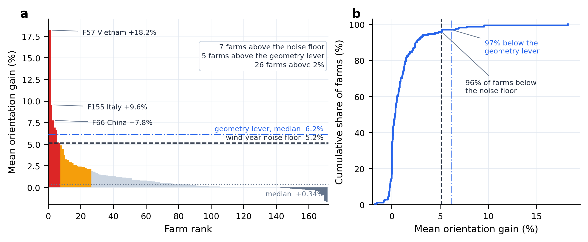
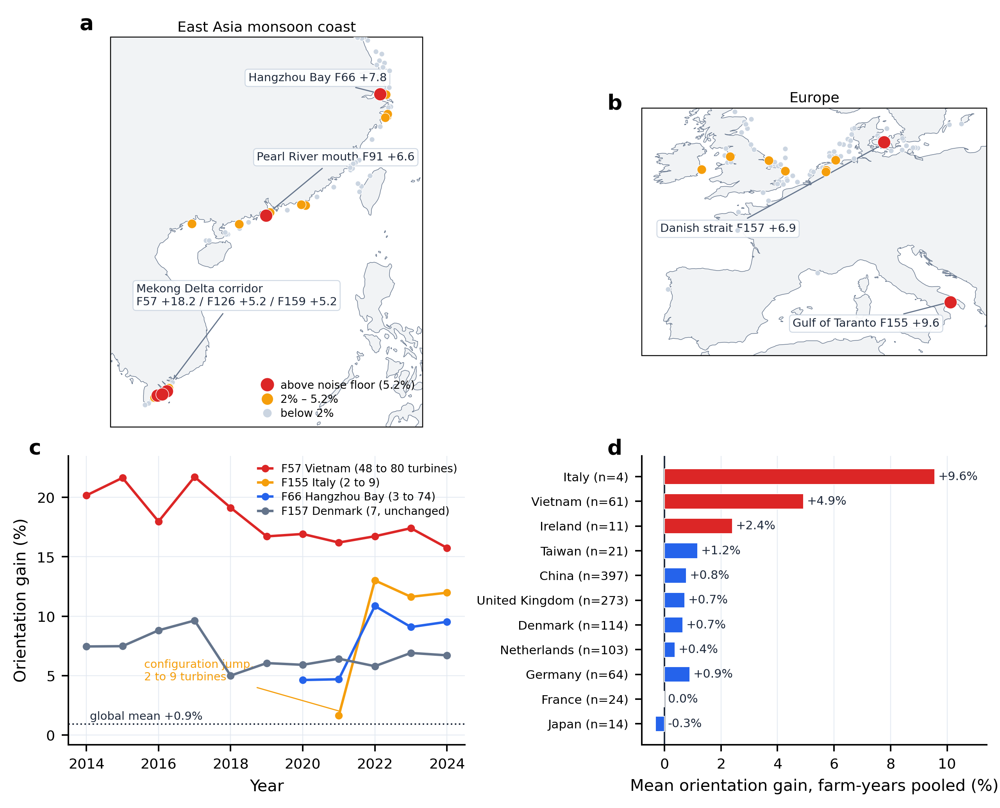
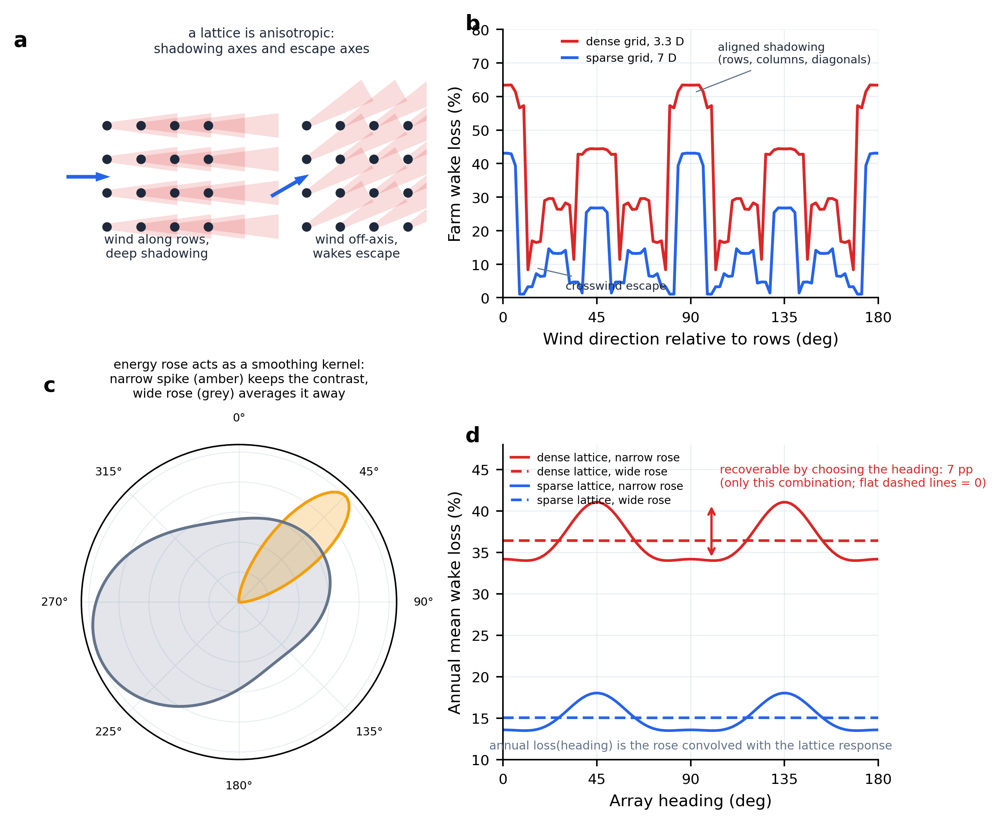
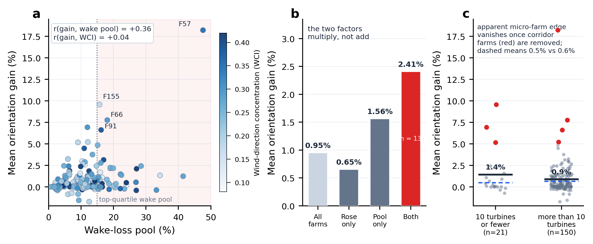

# 朝向在哪里重要：海上风电朝向价值的长尾、机制与全球走廊图谱

### 季风走廊与海峡风道集中了朝向价值，且可用事前观测量预测——基于全球 171 个真实海上风场

*Where array orientation matters: monsoon corridors and strait winds concentrate the orientation value of offshore wind farms*

> 分析材料（NC 体例框架稿 v0.1）· 版本 2026-07-26 · 数据口径：任务一形态识别 / 任务二 FLORIS v4.6 全量核算 / 任务三朝向回测 / 朝向长尾模块 · 定题依据：《研究方案_朝向长尾_走廊图谱.md》（定题 B，四问骨架 2026-07-26 定稿）
> **四问阶梯**：是不是（§2.1 长尾存在）→ 为什么（§2.2 三走廊 + §2.3 乘积成因，全文心脏）→ 在哪里（§2.4 成因足迹）→ 有多大（§2.5 全球赌注）。
> 说明：**【已算】** = 已有计算结果并经复核，**〔待补 xxx〕** = 尚未完成的计算（清单见 §6）。头条纪律：幅度数字（+18.2% 等）不入标题与摘要首句，头条卖走廊图谱与乘积机制；本框架稿的摘要与 §2.4/§2.5 留有图谱数字占位，补算后填入。图 1–3 已按 nc_style 正式绘出（`figures/`），图 4–5 待补算①后出图。

---

## 摘要（草案，图谱数字待填）

阵列朝向被默认是海上风电的核心设计变量，但它是否真的重要、为什么、在哪里、值多少，此前没有全球实证。**是不是**——本研究对全球 171 个真实建成海上风场（17 国、ERA5 2014–2024 逐时气象、统一 FLORIS v4.6 尾流引擎）逐一做旋转回测（以 1981–2010 历史风定出各场最优朝向、在 2014–2024 真实气象下核算可回收发电），发现朝向价值呈高度集中的长尾：场-年中位仅 +0.28%（场级中位 +0.34%、均值 +0.95%），96% 的场址低于 5.2% 的风年噪声地板，但 7 个场越线、最高达 +18.2% 且逐年稳健。**为什么**——越线的场全部聚集于三类可命名的物理走廊（湄公河三角洲季风带、中国杭州湾与珠江口整流区、欧洲海峡风道），其成因是"**单向的风 × 过密的阵**"：季风环流与海峡/湾口地形把风玫瑰压缩成单峰窄扇，密集排布把尾流损失池做大，旋转只能在风玫瑰上重新分配尾流损失，故两条件相乘、缺一不可（尾流池单因子 r = +0.36，WCI 单因子 r = +0.04，两条件交互组收益为全样本 2.5 倍）。**在哪里**——这一成因条件的全球足迹显示，同样的窄玫瑰气候还潜伏于〔待补 N〕个尚未密集开发的海岸（已建场校验查全率〔待补 %〕），与越南、南海、地中海等增量市场高度重合。**有多大**——足迹上承载的全球规划装机约〔待补 X GW〕，按走廊内 5–18% 的朝向价值区间折算，朝向选对与选错之间相差约〔待补 Y TWh/年〕。朝向应在这些走廊被升格为与间距同权重的一等设计变量；在走廊之外，它仍是可让渡给航道、海缆与保护区约束的二阶自由度。

**关键词**：海上风电；阵列朝向；尾流损失；风向集中度；季风走廊；海域空间规划

---

## 1. 引言

海上风电的装机增长重心正从北海转向季风亚洲与地中海。在这一轮扩张中，一个在教科书里默认要优化、在工程实践里普遍被让渡、而其价值地理从未被测量的设计变量重新变得紧要——**阵列朝向**：整片风机点阵相对主导风向的取向。

朝向的价值不由自身决定，而由三个子系统的交点决定。尾流几何决定"损失池"的规模——朝向优化的一切收益都从当前被尾流吃掉的发电中回收；风向气候决定风玫瑰的宽窄——单一固定朝向只在风向集中时才能覆盖足够多的能量小时；海域约束（航道、海缆走廊、保护区、租区形状）决定朝向是否真的可以自由选择。三者在不同海域的组合悬殊，暗示朝向价值必然是空间高度异质的——但这张"价值地图"并不存在。

已有文献在三处留下空白。其一，排布/尾流支在理想化阵列上求解：Warder & Piggott（2024）用固定的理想 5 D 方阵在全球制图，给出布局优化上限约 6–7%，其"中纬度潜力小"的发现提示了朝向价值的空间异质性，却未对**真实建成朝向**做任何测量。其二，经典的单来流对齐结论（Stevens–Gayme–Meneveau 2014：交错 11–12° 最优）在真实多向风气候下的适用边界从未被实证给出——能量加权何时会"洗掉"单来流敏感性、什么样的风玫瑰"足够窄"，缺定量条件。其三，面向增量市场的**事前筛选工具不存在**：开发商在规划期只有风玫瑰与拟建密度，没有工具告诉他们"此处朝向是一等变量"。

针对这些空白，本研究按四问阶梯组织：旋转回测回答**是不是**，走廊地理与乘积条件回答**为什么**，成因条件的全球足迹回答**在哪里**，足迹叠装机管道回答**有多大**。四组主要发现：(1) 朝向价值呈长尾——中位 +0.28%、96% 场址低于风年噪声地板，仅 7 场越线（最高 +18.2%）；(2) 成因是"单向的风 × 过密的阵"——长尾聚集于三类物理走廊，两条件交互组收益 2.5 倍于全样本而单因子近零；(3) 成因足迹在全球识别候选走廊〔待补 N〕个（已建场校验查全率〔待补〕）；(4) 足迹上承载规划装机〔待补 X GW〕，朝向对错之差〔待补 Y TWh/年〕。

---

## 2. 结果

### 2.1 朝向价值呈高度集中的长尾：全球旋转回测作为测量仪器（图 1）

**【已算】** 对 171 个真实场，将整片阵列绕质心刚性旋转到各自的历史最优朝向 θ_opt（1981–2010 ERA5 风频加权、0–170° 每 10° 扫描），再放入 2014–2024 真实逐时气象与真实排布配对核算。这一设计等价于一次**可实施决策规则的事前回测**：开发商在设计期只能用历史风定角，本文用其后十一年的真实天气检验这一决策的价值——训练与检验时段天然分离。

朝向价值的分布高度右偏（图 1）。全样本 1,203 个场-年的增益中位 +0.28%、均值 +0.92%（场级中位 +0.34%、均值 +0.95%），方向极为稳健——64.3% 的场-年为正。把两条**文章内生的标尺**画进同一张分布图：其一是风年噪声地板——容量因子年际变异系数的中位 5.2%，代表"等一个好风年"的天然摆动幅度；其二是几何标尺——点阵优化可回收的中位 6.2%。结果是：**171 场中 164 个（96%）的朝向价值低于风年噪声地板，166 个（97%）低于几何标尺**；仅 26 场（15%）超过 2%、7 场（4.1%）超过 5.2%、1 场超过 10%。全球平均数（+0.9%）是把越南的 +18% 与北海的近零压平后的产物——对绝大多数风场它是实情，对长尾场址它严重失真。**朝向价值的正确读法不是一个平均数，而是一条长尾。**

**〔待补 聚类稳健推断〕** 171 场在空间上成簇（北海、东亚共享风气候），配对 t 检验的独立性假设不成立。改报符号一致率 + 按海盆/国家的 cluster bootstrap 置信区间与分层符号检验，p = 2.9×10⁻⁴⁴ 降为附注（补算⑥，约 1 天）。

> **结论 1｜** 朝向价值呈高度集中的长尾：场-年中位 +0.28%、方向极稳健，96% 的场址低于 5.2% 的风年噪声地板、97% 低于 6.2% 的几何标尺；仅 7 场越线。全球平均数掩盖了决策相关的全部信息——问题从"朝向值多少"变为"朝向在哪里重要"。

*图 1｜朝向价值的长尾与两条内生标尺。（a）柱状图按 2014–2024 平均朝向增益对 171 个风场降序排列；红色表示越过风年噪声地板（5.2%，容量因子年际变异系数的中位）的 7 个场，橙色表示增益介于 2% 与 5.2% 之间的 19 个场，灰色为其余场。两条水平参考线分别给出噪声地板与几何标尺（6.2%，点阵优化中位），点线给出中位 +0.34%。（b）经验累积分布给出同一分布的份额读法，96% 的场低于噪声地板、97% 低于几何标尺。*

### 2.2 长尾不是随机的：聚集于三类可命名的物理走廊（图 2）

**【已算】** 越过噪声地板的 7 个场无一例外落在三类走廊。**湄公河三角洲季风走廊 3 个**——F57（+18.2%）、F126（+5.2%）、F159（+5.2%），全部挤在 9.1–9.5°N 的越南金瓯–槟椥近海：冬季东北季风单向控制，F57 的风向集中度 WCI = 0.35（全样本中位约 0.25）。**中国湾口/海峡整流区 2 个**——杭州湾口 F66（+7.8%，主轴错位 85°）与珠江口 F91（+6.6%，WCI = 0.38，七场中最高）：东北季风经海峡与近岸地形整流后在湾口恢复高度单向。**欧洲海峡风道微型场 2 个**——意大利塔兰托湾 F155（+9.6%）与丹麦海峡 F157（+6.9%），均处地形风道。次级梯队同样偏聚亚洲季风海岸：26 个超过 2% 的场中**东亚 16 个（中国 10、越南 6）**、欧洲 9 个、美东 1 个；且阈值从 2% 扫到 8%，亚洲占比始终在 60–75%，聚集格局对阈值选择稳健。

**【已算】** 长尾不是统计噪声。F57 在 48 台扩建至 80 台的十一年里，增益逐年稳定在 16–22%；两个口径注记如实写入——F155 与 F66 的场均值被建成初期的小台数年份稀释（F155 首年仅 2 台、增益 +1.6%，9 台现配置年份稳定约 +12%；F66 现配置约 +9.7%），F157 七台不变、增益 +5.0~+9.6%。分国家梯度（越南 +4.9%、意大利 +9.6%、爱尔兰 +2.4%、中国 +0.8%、英国 +0.7%、法日 ≈0）与 Warder & Piggott 的"中纬度潜力小"相互印证。

**诚实注记（空间伪重复）**：七个场的独立地理单元只有约 4 个——湄公河三场是同一走廊 0.4° 纬度内的簇。**七个场是逸事，不是气候学**——这正是需要走廊图谱（§2.4）把回顾升级为预测的理由。

**〔待补 幅度资格证三件套〕** 本节全部幅度数字在以下三项补算齐备前以"Gauss + IEA 10MW 口径"限定表述：
1. 〔待补 MERRA-2 玫瑰交叉核验〕7 个 >5% 场的 MERRA-2（可选 CCMP/ASCAT）风玫瑰形状对比 + ±10° 风向扰动敏感性——湄公河/湾口/海峡恰是 ~31 km 再分析最弱的复杂海岸（补算⑤，约 1 周）。
2. 〔待补 跨尾流模型旋转重跑〕26 个长尾场 + 分层抽样 30 场的 Jensen/TurbOPark 旋转扫描——现有"三模型稳健"只覆盖尾流损失基线、不覆盖旋转增益本身（补算②，数天机时）。
3. 〔待补 真实机型敏感性〕F57/F66/F91 用当年实际安装的机型级别（库中 ow_6MW/ow_8MW 参数）重跑旋转扫描，量化"10MW 强制密化"对 +18.2% 的伪影占比（补算③，数天）。

> **结论 2｜** 长尾在地理上聚集于三类可命名的物理走廊（季风走廊、湾口整流区、海峡风道），聚集格局对阈值稳健、对扩建稳健；但独立地理单元仅约 4 个——把逸事升级为气候学需要图谱（§2.4）。〔幅度数字待三件套补算后解除口径限定〕

*图 2｜长尾聚集于三类可命名的物理走廊。（a）东亚季风海岸地图给出各场的增益分级（红 = 越过噪声地板，橙 = 2–5.2%，灰 = 低于 2%），并标注湄公河三角洲走廊（F57 +18.2 / F126 +5.2 / F159 +5.2）、杭州湾口 F66 与珠江口 F91。（b）欧洲地图以同一分级给出塔兰托湾 F155 与丹麦海峡 F157 两个海峡风道场。（c）折线图给出四个代表场的逐年增益，F57 在机组数由 48 台增至 80 台的持续扩建中稳定于 16–22%，F155 在配置由 2 台跳至 9 台后稳定于约 12%。（d）条形图给出分国家的场-年平均增益（n 为场-年数），越南 +4.9%、意大利 +9.6%，法国与日本接近零。*

### 2.3 长尾由乘积条件生成：大尾流池 × 窄风玫瑰，缺一不可（图 3）

**【已算】** 机制上，朝向收益在第一性上就应近似为尾流池规模与风玫瑰各向异性的**乘积**，其物理链条分四层（概念图 C，全部面板由简化 Jensen 模型实算而非示意）：其一，规则点阵天生**各向异性**——存在遮挡轴（风沿行列，下游整排坐在尾流里）与逃逸轴（风斜向来，最近上游机组的有效间距倍增），因此单场尾流损失是来流方向的函数 L(θ)（概念图 Ca,b）。其二，全年损失等于风玫瑰与 L 的**卷积**：旋转阵列不改变 L 的形状与总量，只决定其深谷与高峰停在玫瑰的哪个位置——"旋转只能重新分配损失"的数学含义；玫瑰因而是一个**平滑核**，窄尖峰保留 L 的全部角度起伏（把逃逸轴精确停在尖峰上即可吃到谷峰全差），宽玫瑰则把起伏低通滤波、年均损失对朝向近乎不敏感（概念图 Cc,d——宽玫瑰下可回收严格为零）。其三，密度放大 L 的**谷峰差**：稀疏场任何方向损失都小、曲线本来就平；密排场遮挡轴近乎全深而逃逸轴仍可部分恢复。三层合起来：**尾流池决定"值不值得转"，玫瑰宽窄决定"转了有没有用"**。这一乘积结构直接预言：任一因子的**单独**线性效应都可以很弱，而两因子的**联合**效应显著。数据与预言一致——收益与尾流池的相关 r = +0.36（最强单因子；F57 恰是全球尾流损失最重的场之一，47.6%），与 WCI 的线性相关仅 r = +0.04（**这正是乘积模型的预言而非尴尬**：没有大池时窄玫瑰无用），而"WCI 前 1/4 且尾流池前 1/4"的 13 个场平均收益 2.4%，为全样本（0.95%）的 **2.5 倍**。它同时解释了北海之谜：那里尾流池巨大，但西风带天气系统轮转使玫瑰宽而多峰，一切朝向敏感性被卷积洗平——W&P 的"中纬度潜力小"正是这一卷积的结果。

*概念图 C｜点阵各向异性经风玫瑰卷积后的朝向敏感性（全部面板由简化 Jensen 模型在参考方阵上实算；CT = 0.8，尾流扩张系数 0.05）。（a）示意给出点阵的两类轴向，风沿行列时下游整排被遮挡，风斜向来时尾流从行间逃逸。（b）实算的单场尾流损失随来流方向的响应 L(θ)，稠密方阵（3.3 D，红）的谷峰差远大于稀疏方阵（7 D，蓝），遮挡峰出现在行、列与对角对齐方向。（c）两类能量玫瑰充当卷积平滑核，窄尖峰（琥珀，von Mises κ = 12，拟季风走廊）保留 L 的角度起伏，宽多峰玫瑰（灰，拟北海西风带）将其平均掉。（d）玫瑰与 L 卷积得到的年均损失随阵列朝向的变化：仅"稠密点阵 × 窄玫瑰"组合存在可观的朝向可回收量（7 pp），其余三种组合近乎为零——乘积条件的直接可视化。*

**【已算】** 对立假设经**走廊控制检验**被否证："微型场几何放大"（协作分析曾提出小场收益被系统放大）不成立——以终期配置计，机组数不超过 10 台的 21 个场表观平均收益 1.4%，高于其余场的 0.9%，但这一差异**完全由三个走廊微型场（F155/F157/F159）携带**：剔除七个走廊场后，微型场组 0.5%、其余场 0.6%，差异消失甚至轻微反转（图 3c）。小规模本身不放大朝向收益；表观放大是走廊成员身份的混淆。主轴错位是第三个要件——亚洲高收益场的实际主轴偏离最优 33–85°（方法注记：PCA 主轴对弧形串列/微型排布失真，F157 名义错位仅 1° 却有 +6.9% 收益，错位角仅对规则大场作证据；不规则场改用 AEP(θ) 曲线定义等效偏差，见〔待补 等效偏差〕）。

**〔待补 机制正规检验〕** 连续乘积项回归（gain ~ 池 × 玫瑰交互项）+ 置换检验 + leave-one-corridor-out + 阈值稳健性扫描（三分位/中位/连续），把 n=13 的四分位切格升级为正式统计（补算④，2–3 天纯分析）。**结果风险如实声明**：若正规检验不显著，乘积机制降格为猜想、本节改写。

**〔待补 等效偏差指标〕** 复用已有 0–170°×10° 旋转扫描曲线，对弧形/微型场用 AEP(θ) 曲线定义"等效偏差/罚分平坦度"，替代 PCA 主轴错位角（补算①之一部分，1–2 天后处理）。

> **结论 3｜** 长尾由"大尾流池 × 窄风玫瑰"的乘积条件生成：单因子 r = +0.36 / +0.04；仅窄玫瑰 0.65%、仅大池 1.56%，两者兼备 2.41%（全样本 2.5 倍）——两因子相乘而非相加。"微型场放大"猜想经走廊控制检验被否证。机制的第一性推导——旋转只能重新分配尾流损失——使 WCI 零线性效应成为模型预言。〔正规检验待补算④〕

*图 3｜长尾由乘积条件生成。（a）散点图给出场级增益与尾流池（场均尾流损失）的关系（r = +0.36），着色表示风向集中度 WCI（r = +0.04），竖点线与浅色区标出尾流池前四分之一。（b）分组均值比较展示两条件的乘积性，仅窄玫瑰 0.65%、仅大池 1.56%，两者兼备（n = 13）达 2.41%，为全样本（0.95%）的 2.5 倍。（c）逐点分布检验"微型场放大"假说，按终期机组数是否不超过 10 台分组；表观差异（1.4% 对 0.9%）完全由走廊场（红点）携带，剔除走廊场后两组均值为 0.5% 对 0.6%（蓝色虚线），无放大迹象。*

### 2.4 成因条件的全球足迹：同样的"单向之风"还潜伏在哪些海域（图 4）〔核心新增，全待补，回答"在哪里"〕

**〔待补 成因足迹图谱——本文成败所系，补算①〕** 成因确立后（§2.3），其地理足迹即可绘制：乘积条件的两个因子都有**规划期即可观测**的量——风玫瑰集中度由 ERA5 直接计算（自然给定），尾流池规模由拟建密度决定（设计选择，以行业惯行密度作条件假设）。因此"单向之风"的全球分布可以被直接制图，"过密之阵"以条件句叠加。名分纪律：图谱是**成因条件的地理呈现**（成因成立则足迹成立），事前筛选只作衍生应用表述。计划：

- **方法**：增益代理面 gain(θ | 玫瑰)——以参考点阵的预计算尾流表对任意风向分布做能量加权，得"给定玫瑰下最优朝向相对随机朝向的可回收份额"；逐网格只需 ERA5 风向分布，无需逐格 FLORIS。密度轴以条件式呈现："若按行业惯行 3–4 D 密度建设，此处朝向即为一等变量"。
- **分期**：一期用现有东亚/欧洲 ERA5 出区域版（1–2 周，覆盖全部长尾场与主要增长市场）；二期经 CDS 下载全球逐日风出全球版（+2 周）；可选三期叠加 4C Offshore/GEM 规划租区多边形做前瞻应用。
- **验证纪律**：在 171 个已建场上按 leave-one-corridor-out 报查全率/查准率；表述为**必要条件式诊断**，不承诺点预测。
- **预期呈现**：〔待补 区域/全球图谱底图 + 26 个 >2% 场的验证叠加 + 候选走廊标注（预期候选：北部湾、台湾海峡、〔待补 由图谱产出〕）〕。
- **结果风险如实声明**：尾流池的事前代理只有密度（真实间距与尾流的相关 −0.52，但规划期只有拟建密度）；若查全率不理想，图谱降格为"玫瑰单因子图谱 + 密度条件句"；若整体不成立，本文回退定题 A（《错位无罚》存档方案）。

> **结论 4｜**〔待补——图谱查全率与候选走廊数产出后撰写。目标句式：生成长尾的成因条件在全球的足迹覆盖 N 个尚未密集开发的海岸（已建场校验查全率 X%）——"单向之风"早已就位，只待"过密之阵"落成。〕

〔图 4（killer figure）：成因足迹图谱 + 已建场校验叠加 + 候选走廊标注。全新，待补算①。〕

### 2.5 全球赌注：足迹上承载的装机与朝向对错之差（图 5）〔回答"有多大"〕

**【已算·部分】** 朝向被让渡不是无知而是理性：任务一显示"风资源最优"（范式 A）与"约束优先"（范式 B）两类建设策略**零共现**——朝向在真实项目中被航道、海缆走廊、保护区边界系统性牺牲；而其平均代价（+0.28% 中位）远低于违反约束的工程成本。在可控自由度的层级里，点阵几何（POC 中位 +6.2%、均值 +12.2%）比朝向高一个量级，风速则是选址即锁定的外生天花板（CF~风速 r = 0.92）——**其余约 96% 海域的发电价值应从间距回收，朝向可安全让渡**。

**【已算·部分】** 对长尾走廊，朝向罚分应读作**约束的影子价格**：若 F57 的最优朝向因航道或租区形状不可建，则该约束的机会成本高达 18% AEP——这一读法把"旋转反事实不可执行"的质疑转化为对租区划界与约束定价的直接输入。

**〔待补 全球赌注核算——补算⑧，升为必做〕** 把成因足迹叠上全球装机管道（GWEC/4C 规划数据），量出这件事的全球分量：落在走廊内的规划装机约〔待补 X GW〕；按走廊内 5–18% 的朝向价值区间折算，朝向选对与选错之间相差约〔待补 Y TWh/年〕（直观锚：约合〔待补〕个百万人口城市的年用电）。叙事落点："过去不重要、未来恰恰重要"的定量版——存量市场（北海）把朝向让渡给约束且代价极小（合理），增量市场若沿用同一默认逻辑，将真金白银地付出这笔差价；轻量先行版可先用公开的国家级规划容量按走廊归属粗算。

> **结论 5｜**〔待补赌注数字后定稿。目标句式：成因足迹上承载了全球规划装机的 X GW，朝向对错之差约 Y TWh/年——增量市场应在规划期把朝向升格为与间距同权重的一等设计变量，并以朝向罚分为约束定价；走廊之外朝向可安全让渡，价值从间距回收。〕

〔图 5：图谱 × 增长市场装机管道叠加（可并入图 4 双面板）；自由度层级作插图或 SI。〕

---

## 3. 讨论（框架）

**朝向价值的正确单位是一张地图，不是一个平均数。** "平均无关紧要"与"局部一等重要"并存的本质，是乘积条件的空间稀缺性——大尾流池要求密集排布，窄风玫瑰要求季风或地形整流，两者同时成立的海域天然稀少且可命名。本文把一个被全球平均数掩埋的设计变量还原成可操作的地理。

**与既有文献是补图而非对撞。** Warder & Piggott（2024）的理想方阵从未测量真实建成朝向，其"中纬度潜力小"恰是本文图谱的低值区，本文补上其没有的高值走廊；对 Stevens–Gayme–Meneveau（2014）给出适用域的定量边界——单来流对齐敏感性在多向气候被能量加权洗掉，除非玫瑰窄到本文给出的条件；对 Jung（2022）的"技术 vs 气候"二分补充"几何 × 方向"维度。

**时间结构："过去不重要、未来恰恰重要"。** 存量市场已把朝向让渡给约束且代价极小（合理）；增量市场恰与走廊带重合，默认逻辑将付出 5–18% 的代价。图谱给规划者一个规划期即可执行的筛查步骤，朝向罚分给监管者一个约束定价的标尺。

**局限（每条配未来方向）**：(1) 刚性旋转是给定内部几何的单自由度边际价值下界——〔待补 朝向×几何联合优化份额实验（补算⑦，F57 必做）：回答"+18.2% 占联合优化增益的几成"〕；(2) 统一机型与 Gauss 模型的工作区间——由三件套敏感性限定（§2.2）；(3) ERA5 近岸方向保真——MERRA-2 核验之外，实测风塔/激光雷达核验留待未来；(4) 风向气候漂移未实算——仅 SI 做 ±5/10/15° 玫瑰刚性漂移的风格化敏感性；顺带指出季风走廊方向气候稳定，反而是"朝向决策可长期锁定"的有利证据。

---

## 4. 结论（框架）

〔待补图谱与赌注数字后成稿。骨架按四问收束：**是**（7 场越 5.2% 噪声地板、最高 +18.2% 且逐年稳健）；**为什么**（"单向的风 × 过密的阵"，交互组 2.5 倍、单因子近零）；**在哪里**（候选走廊 N 个、已建场查全率 X%）；**有多大**（走廊内规划装机 X GW、朝向对错之差 Y TWh/年）——落在"朝向的规划地理学"上：用一张事前地图把一等变量与可让渡变量分开；增量市场的窗口仍开着，存量市场的已经关闭。〕

---

## 5. 方法（摘要框架）

**真实机位与风场数据体系。**【已算】DeepOWT v2.25.1 全球 15,106 台机位；ERA5 100 m 逐时（2014–2024，三区域）；GEBCO 2024；统一 IEA 10MW（真实机型敏感性另见〔待补③〕）。DBSCAN 聚类建场、逐年 cumulative 存量。

**尾流仿真引擎。**【已算】FLORIS v4.6 Gauss 主模型，分箱预计算 + 逐时查表（经旋转测试/打乱对照/精度自检审计）；〔待补② 旋转增益的 Jensen/TurbOPark 覆盖〕。

**旋转回测与事前决策规则设计。**【已算】θ_opt 由 1981–2010 逐日 ERA5 风频加权在 0–170°（10° 步长）扫描确定；与真实排布在 2014–2024 同一逐时气象下配对核算。训练/检验时段天然分离；附注：改用核算期内生最优角只会抬高增益、方向不变。术语表：刚性旋转 = 阵列级单一设计自由度，非偏航、非 wake steering（FLORIS 内风机默认对风）。

**聚类稳健推断。**〔待补⑥〕符号一致率 + 海盆/国家 cluster bootstrap CI + 分层符号检验。

**等效偏差与朝向敏感曲线。**〔待补①部分〕AEP(θ) 曲线定义等效偏差与罚分平坦度；PCA 主轴错位角仅对规则大场报告（n=167 剔除标准明示）。

**乘积机制回归。**〔待补④〕连续交互项回归、置换检验、leave-one-corridor-out、阈值稳健性扫描；对立假设（微型场放大）检验【已算】。

**走廊图谱构建。**〔待补①〕gain(θ|玫瑰) 增益代理面定义；参考点阵与密度条件化；ERA5 逐网格风向分布；验证协议（171 场 leave-one-corridor-out 查全率/查准率）；分期实施（区域版/全球版/租区叠加）。

**风向数据交叉核验。**〔待补⑤〕7 场 MERRA-2（CCMP/ASCAT 可选）玫瑰形状对比；±10° 风向扰动敏感性（兼作风格化漂移情景）。

**朝向×几何联合优化份额。**〔待补⑦〕POC 12 场框架内，建成朝向 vs 最优朝向下分别点阵重优化；F57 必做。

---

## 6. 待补计算清单（按优先级；与《研究方案》§8 对应）

1. **【定题成败·最优先】走廊图谱一期（区域版）**——gain(θ|玫瑰) 代理面 + 现有东亚/欧洲 ERA5 + 171 场 LOO 验证（1–2 周）。查全率不成立 → 回退定题 A。
2. **【幅度资格证】跨尾流模型旋转增益重跑**（数天）：26 长尾场 + 分层 30 场，Jensen/TurbOPark。
3. **【幅度资格证】头条场真实机型敏感性**（数天）：F57/F66/F91 用 ow_6MW/ow_8MW 级参数重跑，量化 10MW 密化伪影。
4. **【机制护城河】连续乘积回归 + 置换 + leave-one-corridor-out**（2–3 天）。不显著 → 机制降格、§2.3 改写。
5. **【数据源资格证】7 场 MERRA-2 玫瑰交叉核验 + ±10° 扰动**（约 1 周）。
6. **【推断修复】聚类 bootstrap 替换配对 t**（1 天）。
7. **【作用域】朝向×几何联合优化份额**（约 1 周，F57 必做）。
8. **【回答"有多大"·升为必做】全球赌注核算**（1–2 周）：全球版图谱（CDS 全球逐日风，+2 周）+ GWEC/4C 装机管道叠加，产出"走廊内规划装机 X GW、朝向对错之差 Y TWh/年"；轻量先行版先用国家级规划容量按走廊归属粗算，租区多边形精算作 revision 弹药。

---

## 7. 风险与措辞红线

- 幅度数字不入标题与摘要首句；出现必附稳健性区间（三件套齐备前以"Gauss + IEA 10MW 口径"限定）。
- "方向极稳健、幅度低于 96% 场址的年际噪声地板"；严禁"不显著""可忽略""免费"。
- 图谱是必要条件式诊断，非点预测；查全率照实报告。
- 刚性旋转 ≠ 偏航 ≠ wake steering；风向气候漂移未实算（SI 风格化敏感性 + 展望）。
- 空间伪重复主动明写（独立地理单元约 4 个）；F155/F66 场均值稀释注记照写。
- 间距口径统一"最近邻 3.3D"；标错的 Meneveau PDF 不得引用；全部引文 Crossref 核验。
- 两条退路：图谱不成立 → 回退定题 A；机制检验不显著 → §2.3 降格改写、图谱降为单因子诊断。

## 8. 图注（Figure legends）

**图 1｜朝向价值的长尾与两条内生标尺。**（a）柱状图按 2014–2024 平均朝向增益对 171 个风场降序排列；红色表示越过风年噪声地板（5.2%，容量因子年际变异系数的中位）的 7 个场，橙色表示增益介于 2% 与 5.2% 之间的 19 个场，灰色为其余场。两条水平参考线分别给出噪声地板与几何标尺（6.2%，点阵优化中位），点线给出中位 +0.34%。（b）经验累积分布给出同一分布的份额读法，96% 的场低于噪声地板、97% 低于几何标尺。〔待补 聚类 bootstrap 置信区间附注〕

**图 2｜长尾聚集于三类可命名的物理走廊。**（a）东亚季风海岸地图给出各场的增益分级（红 = 越过噪声地板，橙 = 2–5.2%，灰 = 低于 2%），并标注湄公河三角洲走廊（F57 +18.2 / F126 +5.2 / F159 +5.2）、杭州湾口 F66 与珠江口 F91。（b）欧洲地图以同一分级给出塔兰托湾 F155 与丹麦海峡 F157 两个海峡风道场。（c）折线图给出四个代表场的逐年增益，F57 在机组数由 48 台增至 80 台的持续扩建中稳定于 16–22%，F155 在配置由 2 台跳至 9 台后稳定于约 12%。（d）条形图给出分国家的场-年平均增益（n 为场-年数），越南 +4.9%、意大利 +9.6%，法国与日本接近零。〔待补 MERRA-2 玫瑰对比小图（补算⑤后并入或置 SI）〕

**图 3｜长尾由乘积条件生成。**（a）散点图给出场级增益与尾流池（场均尾流损失）的关系（r = +0.36），着色表示风向集中度 WCI（r = +0.04），竖点线与浅色区标出尾流池前四分之一。（b）分组均值比较展示两条件的乘积性，仅窄玫瑰 0.65%、仅大池 1.56%，两者兼备（n = 13）达 2.41%，为全样本（0.95%）的 2.5 倍。（c）逐点分布检验"微型场放大"假说，按终期机组数是否不超过 10 台分组；表观差异（1.4% 对 0.9%）完全由走廊场（红点）携带，剔除走廊场后两组均值为 0.5% 对 0.6%（蓝色虚线），无放大迹象。〔待补 连续乘积项回归面板（补算④后并入）〕

**概念图 C｜点阵各向异性经风玫瑰卷积后的朝向敏感性。**（a）示意给出点阵的遮挡轴与逃逸轴；（b）实算的 L(θ) 响应，稠密方阵（3.3 D）谷峰差远大于稀疏方阵（7 D）；（c）窄尖峰玫瑰与宽多峰玫瑰作为卷积平滑核的对比；（d）卷积所得年均损失随朝向的变化——仅"稠密 × 窄玫瑰"组合有可观回收量（7 pp），其余组合近乎为零。全部面板由简化 Jensen 模型实算（CT = 0.8，扩张系数 0.05，6×6 参考方阵）；成稿时拟作正文机制图或并入图 3。

**图 4｜成因条件的全球足迹。**〔待补 全图：底图给出 gain(θ|玫瑰) 增益代理面在全球近海网格上的取值（以行业惯行密度作条件假设）；叠加 171 个已建场作校验（26 个 >2% 场的查全率）；标注候选走廊。〕

**图 5｜全球赌注：足迹上承载的装机与朝向对错之差。**〔待补：足迹与 GWEC/4C 装机管道的叠加图 + 赌注核算条形（X GW、Y TWh/年）；自由度层级作插图。〕
